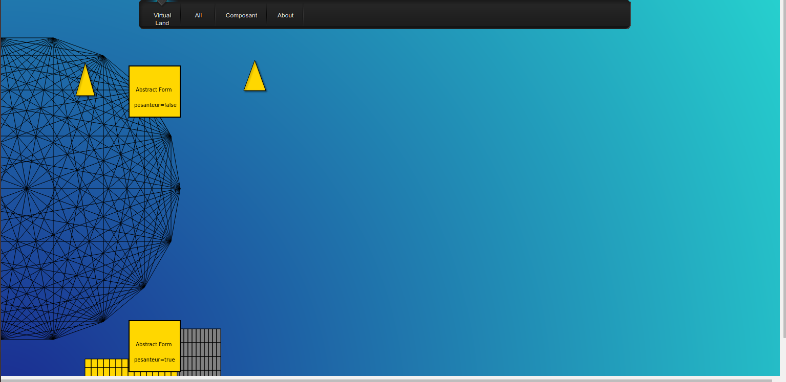

## Générateur de paysages virtuels 

Projet de développement logiciel à destinatation d'apprentis développeur.

Objectifs  

* prise en main d'une petite application javascript (sans framework)
* programmation en javascript dans une approche objet et événementielle
* utilisation de l'API 2D JS intégrée
* développement de la créativité  

### Squelette de l'application

#### structure des dossiers

```
.
├── css
│   ├── lavalamp.png
│   ├── layout.css
│   ├── menu_bg.png
│   ├── menu.css
│   └── menu_line.png
├── docs
│   ├── analyse.dia
│   ├── analyse.png
│   ├── java-genPaysageEtudiant.zip
│   └── java-paysage-virutel.png
├── index.html
├── js
│   ├── main.js
│   └── modules
│       ├── AbstractForm.js
│       ├── Immeuble.js
│       └── Triangle.js
└── README.md
```

* `index.html` : le point d'entrée de l'interprétation par un navigateur. Hormis les inclusion `css`, 
ce fichier contient quelques instructions `javascript` faisant appel à des fonction de `main.js`
* `css` : l'application utilise le template : http://www.script-tutorials.com/pure-css3-lavalamp-menu/
* `main.js` : déclare utiliser des modules (des classes `js`) et définit 2 fonctions : ̀

```javascript 
function drawThisForm(whichForm) {
  if (whichForm === 'Immeuble') {
    _drawForms(Immeuble.buildForms())
  } else if (whichForm === 'Triangle') {
    _drawForms(Triangle.buildForms())
  } else if (whichForm === 'AbstractForm') {
  _drawForms(AbstractForm.buildForms())
  }
}

function drawAllForms () {
  _drawForms(buildForms())
}
```

le dossier `modules` : il contient le code source de classes javascript. C'est dans ce dossier 
que vous placerez vos classes représentant les formes issues de votre imagination. 

* `AbstractForm.js` : c'est la classe de base des formes à venir (deux sont fournies en exemple)
* `Immeuble.js` et `Triangle.js` sont des exemples.

Les nouvelles formes seront représentées par des classes

Conformément aux exemples fournis 
 
 


#### Délivrée par un serveur HTTP

Attention, l'application doit être placée derrière en serveur HTTP, et 
donc accessible à un utilisateur en réponse à une 
requête de type `http://` (et non en protocole `file://`)  


### Comment démarrer ?

1. Étudier le tutoriel https://developer.mozilla.org/fr/docs/Tutoriel_canvas/Utilisation_de_base - pour un internet ouvert - Fondation Mozilla open source (https://www.mozilla.org/fr/about/manifesto/)  
2. Étudier le code de `index.html`, `main.js` et autres de l'application.
3. Créer une nouvelle classe dans `modules` en vous basant sur une idée originale et des exemples glanés sur le net 
4. Mettre au point ... 

### Analyse du code existant

#### index.html

La barre de menu contient une liste déroulante présentant les composants de forme

```html
  <li><a class="hsubs" href="#">Composant</a>
      <ul class="subs">
        <li><a href="#" onclick="drawForm('Immeuble');return false;">Immeuble</a></li>
        <li><a href="#" onclick="drawForm('Triangle');return false;">Triangle</a></li>
        <li><a href="#" onclick="drawForm('AbstractForm');return false;">AbstractForm</a></li>
      </ul>
  </li>
```

Un clic utilisateur sur un des items de cette liste provoquera 
un appel à la fonction `drawForm`.

```javascript
<script type="module" src="js/main.js"></script>

<script>
  function drawForm(form) {
    document.drawForm(form)
  }
</script>

``` 
En allant voir  `main.js` on comprend que la fonction `drawForm` 
est une référence la fonction  `drawThisForm` du module `main.js` (importé juste avant)
  

### ajouter/supprimer une nouvelle classe de forme

Voici où vous devriez alors intervenir  :

* dans `index.html`, ajouter un ou supprimer un item à la liste `<li>` qui 
définit la fonction `js` à appeler lorsque l'utilisateur clique sur le lien l'instruction 
`return false;` qui suit est pour là pour stopper l'action normal du navigateur 
lorsque l'utilisateur clique sur un lien - comme suivre le lien ou scroller la page).     

```html
  <li><a class="hsubs" href="#">Composant</a>
      <ul class="subs">
        <li><a href="#" onclick="drawForm('Immeuble');return false;">Immeuble</a></li>
        <li><a href="#" onclick="drawForm('Triangle');return false;">Triangle</a></li>
        <li><a href="#" onclick="drawForm('AbstractForm');return false;">AbstractForm</a></li>
      </ul>
  </li>
```

* dans `main.js`, modifier les fonctions `drawThisForm` et `drawThisForm`  

```javascript

/**
 * construit les différentes formes du paysage, en appelant la méthode statique
 * buildForms de chacune des classes
 * 
 * @return {Object[]}
 */
function buildForms() {
  let forms = Immeuble.buildForms()
  forms = forms.concat(Triangle.buildForms())
  forms = forms.concat(AbstractForm.buildForms())
  // à compléter/modifier
  // etc. pour chacune de vos classes
  return forms
}

/**
 *  dessine uniquement la forme passée dont le nom est reçu en paramètre
 * @param whichForm (si on peut le faire en dynamaique, je suis preneur,
 *                    style passer la classe au lieu de son nom)
 */
function drawThisForm(whichForm) {
  if (whichForm === 'Immeuble') {
    _drawForms(Immeuble.buildForms())
  } else if (whichForm === 'Triangle') {
    _drawForms(Triangle.buildForms())
  } else if (whichForm === 'AbstractForm') {
    _drawForms(AbstractForm.buildForms())
  }
}

```

* Lors d'un ajout d'une nouvelle classe  (par exemple `MaNouvelleFome.js`), 
redéfinir les méthodes `static buildForms()` et ` draw(ctx)`. Prendre exemple sur `Immeuble` et `Triangle`

 

INFO: le CSS n'est pas top : présence d'un scrolling de page (fait disparaitre le menu) 
et petite marge à droite non désirée... Un nettoyage du layout doit être mené ! (sans ajout de bibliothèques tierces)

<hr>

##### Pour info, un historique en java

 

[Exemple d'un projet d'étudiant - code et executable en java](docs/java-genPaysageEtudiant.zip) 

Une fois décompressé :

`=> lancement   : java -jar paysage.jar`

`=> son rapport : ./genPaysage/rapport/`

`=> le code source : ./genPaysage/*`


